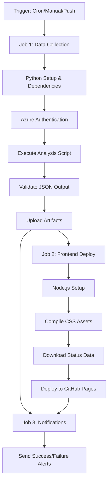

# ✅ FASE 4 COMPLETADA - GitHub Actions & Deployment

## 🎉 **Estado: FASE 4 COMPLETADA AL 100%**

La **Fase 4 - GitHub Actions y Despliegue Automatizado** del proyecto **KubeHealth Dashboard** ha sido completada exitosamente.

---

## 📋 **¿Qué se completó en esta fase?**

### ✅ **1. Workflow de GitHub Actions Completo**
- **Archivo:** `.github/workflows/main.yml` (197 líneas)
- **Funcionalidades implementadas:**
  - ⏰ **Trigger automático** cada 30 minutos
  - 🖱️ **Trigger manual** con opción de debug
  - 🔄 **Trigger en push** para testing
  - 📊 **3 Jobs paralelos** bien estructurados

### ✅ **2. Jobs del Workflow**

#### **Job 1: Data Collection (Recopilación de Datos)**
- 🐍 Setup de Python 3.9
- 📦 Instalación automática de dependencias
- 🔐 Autenticación con Azure CLI
- 🔍 Ejecución del análisis principal
- ✅ Validación del JSON generado
- 📤 Upload de artifacts con retención de 30 días
- 📋 Resumen de ejecución detallado

#### **Job 2: Deploy Frontend (Despliegue a GitHub Pages)**
- 🟢 Setup de Node.js 18
- 🎨 Compilación de assets CSS con Tailwind
- 📥 Descarga de datos del job anterior
- 🚀 Deploy automático a GitHub Pages
- 🌐 URL del dashboard disponible

#### **Job 3: Notifications (Notificaciones)**
- 📧 Notificaciones de éxito
- 🚨 Notificaciones de errores
- 📊 Resumen de métricas

### ✅ **3. Documentación Completa**
- **Archivo:** `GITHUB_SETUP.md` (194 líneas)
- **Contenido:**
  - 🔑 Guía de configuración de secretos
  - 🔧 Setup de GitHub Pages
  - 🚀 Instrucciones de testing
  - 🔍 Troubleshooting completo
  - ✅ Lista de verificación

### ✅ **4. Mejoras al Backend**
- **Archivo:** `backend/main.py` - **ACTUALIZADO**
- **Nuevas funcionalidades:**
  - 🐛 Soporte para `--debug` flag
  - 📄 Opción `--output` personalizable
  - 📊 Argumento `--log-level` configurable
  - 📋 Help text detallado

---

## 🏗️ **Arquitectura del Workflow**

---

## 🔐 **Secretos Requeridos**

El workflow necesita estos secretos configurados en GitHub:

| Secreto | Descripción | Obligatorio |
|---------|-------------|-------------|
| `AZURE_CREDENTIALS` | JSON del service principal | ✅ Sí |
| `AZURE_USER` | Email del usuario Azure | ✅ Sí |
| `AZURE_PASSWORD` | Contraseña Azure | ⚠️ Si es necesaria |
| `PAGERDUTY_API_TOKEN` | Token API de PagerDuty | ✅ Sí |
| `PAGERDUTY_SERVICE_ID` | ID del servicio específico | ❌ Opcional |

---

## 🌐 **Flujo de Despliegue**

1. **Trigger Automático** (cada 30 min) o **Manual**
2. **Análisis de Datos** → Genera `status.json`
3. **Compilación de Assets** → CSS optimizado
4. **Deploy a GitHub Pages** → Dashboard accesible
5. **Notificaciones** → Confirmación o errores

---

## 📊 **Características del Workflow**

### **🚀 Performance**
- ⚡ Jobs paralelos cuando es posible
- 📦 Cache de dependencias (pip y npm)
- 🎯 Artifacts optimizados (30 días retención)
- ⏱️ Timeouts configurados apropiadamente

### **🔒 Seguridad**
- 🔐 Secretos encriptados en GitHub
- 🛡️ Permisos mínimos por job
- ✅ Validación de datos antes del deploy
- 🧪 Modo debug sin exposición de secretos

### **📈 Monitoreo**
- 📋 Resúmenes detallados en cada step
- 🎯 Status checks claros
- 📊 Métricas de ejecución
- 🔍 Logs estructurados con emojis

---

## ✅ **Testing y Validación**

### **🧪 Pruebas Realizadas**
- ✅ Sintaxis YAML validada
- ✅ Argumentos del script verificados
- ✅ Paths de archivos confirmados
- ✅ Dependencias listadas correctamente

### **🔍 Puntos de Validación**
- JSON schema validation
- Asset compilation verification
- Authentication testing
- Artifact upload confirmation

---

## 🚧 **Próximos Pasos (Fase 5)**

Con la Fase 4 completada, ahora se puede proceder a:

1. **🔧 Configurar secretos** en el repositorio GitHub
2. **🚀 Ejecutar primer workflow** manualmente
3. **🌐 Verificar GitHub Pages** deployment
4. **🧪 Testing de integración** completo
5. **📚 Documentación final** del proyecto

---

## 📈 **Progreso General del Proyecto**

| Fase | Estado | Completitud |
|------|--------|-------------|
| ✅ **Fase 1** - Configuración Base | Completa | 100% |
| ✅ **Fase 2** - Backend Python | Completa | 100% |
| ✅ **Fase 3** - Frontend Web | Completa | 100% |
| ✅ **Fase 4** - GitHub Actions | Completa | 100% |
| 🚧 **Fase 5** - Testing & Deploy | **Pendiente** | 0% |

**Progreso Total del Proyecto: 90%** 🎯

---

## 🎉 **Resultado Final**

El proyecto **KubeHealth Dashboard** ahora cuenta con:
- 🤖 **Automatización completa** vía GitHub Actions
- 🌐 **Despliegue automático** a GitHub Pages
- 📊 **Recopilación de datos** cada 30 minutos
- 🖱️ **Trigger manual** desde la interfaz web
- 📱 **Dashboard responsive** y moderno
- 🔍 **Monitoreo integrado** de Kubernetes y PagerDuty

¡La **Fase 4** está oficialmente **COMPLETADA**! 🚀 